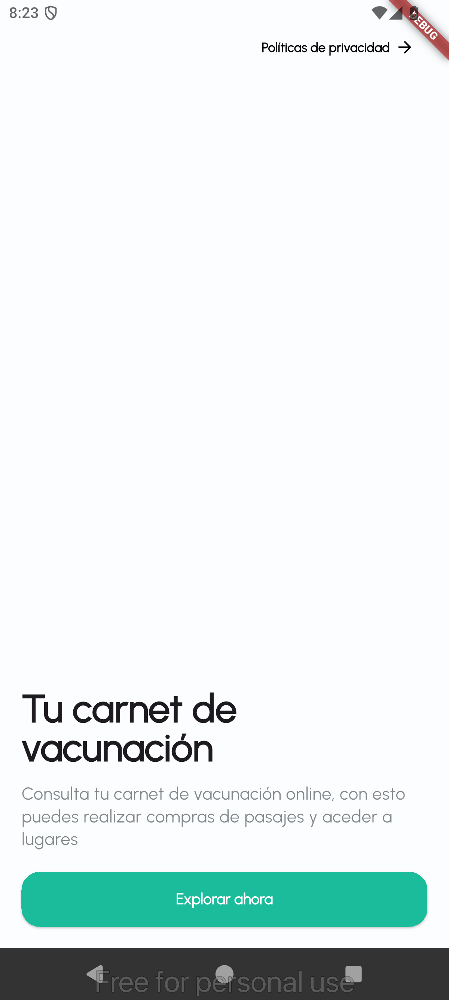
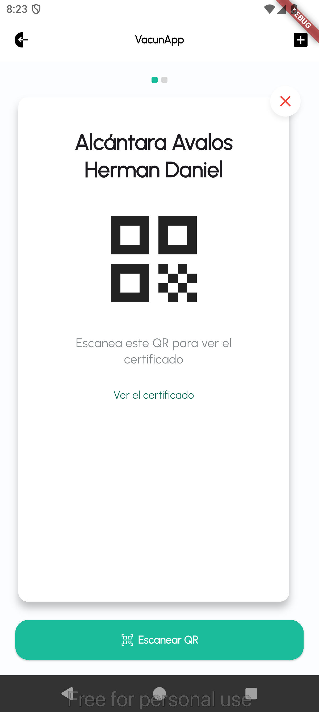
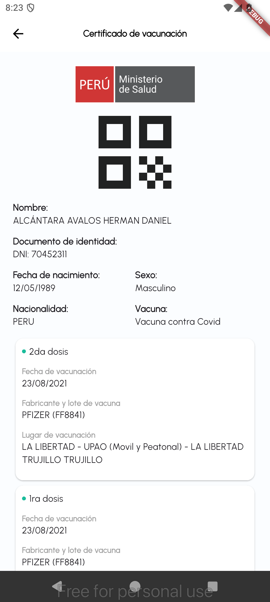
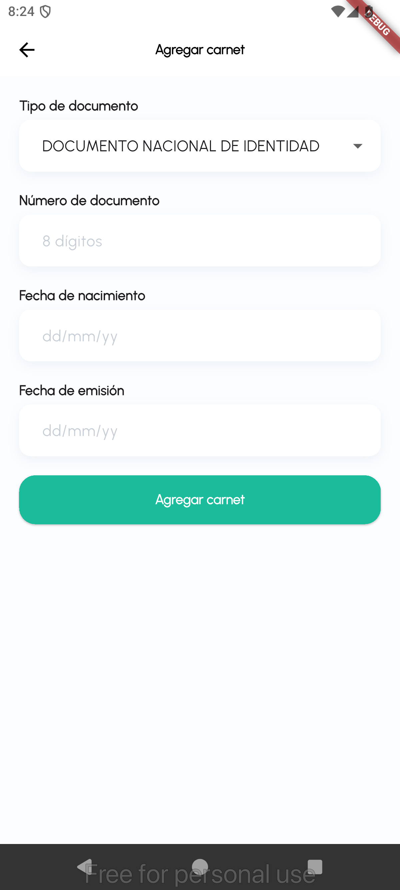
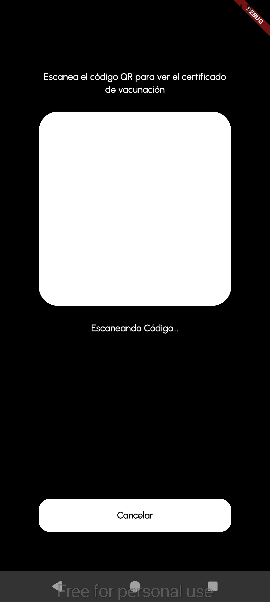

# VacunApp

[English version](README-EN.md)

Aplicación móvil hecha con Flutter para consultar, mostrar y gestionar carnets de vacunación digitales.

El proyecto nace como una propuesta abierta para explorar una experiencia simple de carnet digital: Carnet por persona, Certificados de vacunación y escaneo de códigos QR.

## Características

- Visualización de carnets de vacunación por persona.
- Carrusel para navegar entre carnets registradas.
- Pantalla para agregar un nuevo carnet.
- Vista de certificado de vacunación.
- Scanner de código QR.

## Capturas

| Introducción | Carnets | Sin carnets |
| --- | --- | --- |
|  |  |  |

| Certificado | Agregar carnet | Escanear QR | QR válido |
| --- | --- | --- | --- |
|  |  |  |  |

## Tecnologías

- Flutter
- Dart

## Entorno de desarrollo

Este proyecto fue creado y probado con:

| Herramienta | Versión |
| --- | --- |
| Flutter | 3.35.4 |
| Dart | 3.9.2 |


## Primeros pasos

Clona el repositorio e instala las dependencias:

```bash
flutter pub get
```

Ejecuta la aplicación:

```bash
flutter run
```

## Créditos

Diseño de interfaz inspirado y acreditado a **Daniel Alcántara Avalos**.

- Dribbble: [daniAlav](https://dribbble.com/daniAlav)

Desarrollo por **Roy Parejo Estrada**.

## Licencia

Este proyecto es público y libre bajo la licencia MIT. Puedes usarlo, estudiarlo, modificarlo y compartirlo respetando los términos de la licencia.

Consulta el archivo [LICENSE](LICENSE) para más detalles.
